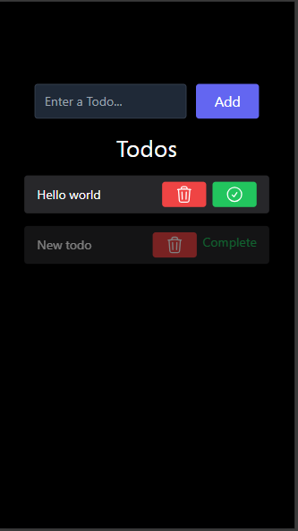
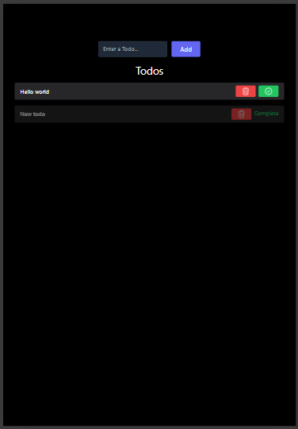
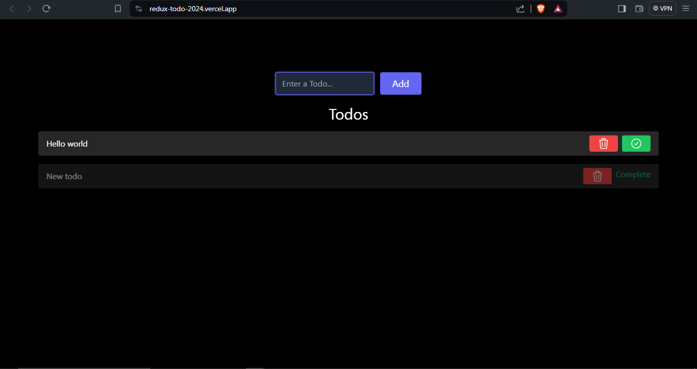

## Overview

Redux Todo Application is a simple task management application built with React and Redux. It allows users to add, remove, and mark todos as completed. The application utilizes local storage to persist todos, ensuring they are not lost upon page reload.

## Features

**Add a Todo:**
Users can add new todos to the list.

**Remove Todo:** Users can remove todos from the list.

**Mark as Completed:** Users can mark todos as completed.

**Persistent Storage:** Todos are saved to local storage, providing persistence across page reloads.

**Dark Theme:** The application features a dark theme for improved readability and aesthetics.

**Responsive Design:** The application is designed to be responsive, providing optimal viewing and interaction experiences across various devices.

## Screenshots

### Mobile View

### Tablet View

### Desktop View\n

## Hosted Link

[Redux Todo Application](https://redux-todo-2024.vercel.app/)

## Installation

1. Clone the repository:` git clone https://github.com/BHANUJATIN/redux_todo_2024.git  `

2. Install dependencies:
   `  npm install  `
3. Start the development server:`  npm start  `
4. Open your browser and navigate to `http://localhost:5173`.

## Technologies Used

- React
- Redux
- Tailwind
- vite
- HTML/CSS

## Contributors

- [Bhanu Jatin Singh](https://github.com/bhanujatin)
